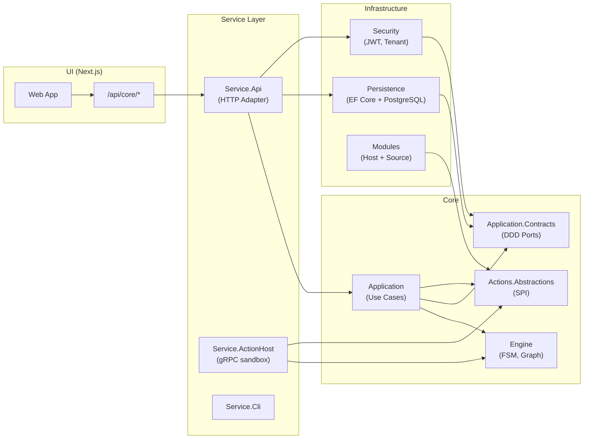

# アーキテクチャ

| 項目 | 値 |
| --- | --- |
| 種別 | Architecture |
| Version | 2.4 |
| 更新日 | 2026-09-27 |
| 関連 | [domain-model-boundaries.md](domain-model-boundaries.md), [repository-layout.md](repository-layout.md) |

Project: Statevia — Definition Driven Execution Platform

**Version 2.4（2026-09-27）**: 定期実行は `v1/schedules` と Runtime の Dispatcher。Start は `IExecutionService`。Engine のスケジューラレイヤー（§4.5）とは別。

**Version 2.3（2026-09-01）**: Service API の HTTP 面を auth / admin / events / Module reload まで列挙。

**Version 2.1（2026-08-13）**: Execution ユースケースを `IExecutionService` Facade とドメインサービスへ分割した責務を反映。

**Version 2.0（2026-07-04）**: 4 カテゴリ構成（core / infrastructure / service / ui）とクリーン・アーキテクチャ準拠を反映。

---

## 1. システム構成

### 1.1 構成の要点

- **Core-Engine（C#）**: `core/engine/` のライブラリ。API プロセス内で `IExecutionEngine` として同一プロセス利用。独立 HTTP サービスはない。
- **Core-Application（C#）**: `core/application/`。ユースケース実装。Engine / Actions.Abstractions のみに依存し、infrastructure / service を参照しない。
- **Infrastructure（C#）**: `infrastructure/`。EF Core 永続化、JWT 認証、通知、Module ホスト等の技術実装。
- **Service API（C#）**: `service/api/`。ASP.NET Core。HTTP アダプタとして v1/definitions・v1/executions を提供。Composition Root として全層を結合。
- **UI（TypeScript）**: `ui/studio/`。Next.js。Route Handler のプロキシ（`/api/core/*`）で Service API の `/v1/*` に転送。

### 1.2 全体図



### 1.3 ディレクトリ対応

| 役割 | 場所 |
| --- | --- |
| Core-Engine | `core/engine/Statevia.Core.Engine/` |
| Core-Application | `core/application/Statevia.Core.Application/` |
| Application Contracts | `core/application/Statevia.Core.Application.Contracts/` |
| Actions Abstractions | `core/actions/Statevia.Core.Actions.Abstractions/` |
| Reference Modules | `modules/reference/`（実行時は `modules/default/`） |
| Persistence | `infrastructure/Statevia.Infrastructure.Persistence/` |
| Security | `infrastructure/Statevia.Infrastructure.Security/` |
| Service API | `service/api/Statevia.Service.Api/` |
| Action Host | `service/action-host/Statevia.Service.ActionHost/` |
| CLI | `service/cli/Statevia.Service.Cli/` |
| UI | `ui/studio/` |

### 1.4 Docker 構成（参考）

- **postgres**: データベース
- **service-api**: C# API（`service/api/Dockerfile`）
- **ui**: Next.js（`ui/studio/Dockerfile`）

`docker-compose.yml` はリポジトリルートに配置。

---

## 2. 責任分界

### 2.1 Core-Engine（C# ライブラリ）

- 定義のロード・検証・コンパイル（Definition）
- FSM 遷移・Fork/Join・スケジューラ（Engine / FSM / Join / Scheduler）
- 状態実行・ExecutionGraph の更新（Execution / ExecutionGraph）
- 終端の優先順位はエンジン内で保証

### 2.2 Core-Application（ユースケース）

- 定義の登録・publish・一覧・取得。project ロールは `IProjectAuthorizationService` でユースケースがゲートし、`IDefinitionRepository` は素の永続化（Infrastructure）
- 実行系は `IExecutionService` の薄い Facade。HTTP / Worker は Facade のみを見る
- 実処理はドメインサービスへ委譲する（Query / Lifecycle / WaitEvent / Checkpoint / Ownership / Recovery / Projection）。冪等は `ExecutionIdempotencyService`、親 Physical Join は `ExecutionForkJoinCoordinator`
- 横断: `ExecutionAuthorizationGuard`（認可）、`ExecutionEngineSession`（hydrate）。Unload ゲートは Checkpoint 側
- Facade は Repository / Auth / Engine を直接持たない
- セキュリティスナップショット・Action スキーマ検証

### 2.3 Infrastructure

- EF Core 永続化（CoreDbContext、Migrations、`IDefinitionRepository` を含む Repository 実装）
- JWT 発行・検証・テナントコンテキスト
- 通知送信（SMTP）
- Module ホスト・OCI Source・署名検証
- gRPC Action Backend
- ID 生成（`IIdGenerator`）
  - 永続 PK / 文書キー: `NewSequentialGuid()`（UUIDv7・時刻順）
  - 非永続（TraceId・lease 接尾辞等）: `NewRandomGuid()`（UUIDv4 相当）
  - 本番ホストでは生 `Guid.NewGuid()` を禁止（BannedApi パイロット）。Engine・テストは対象外
  - 固定シード既定テナント ID と適用済みマイグレーションの `gen_random_uuid()` は変更しない
  - DelayWait / ownership recovery の一括 enqueue SQL は当面 `gen_random_uuid()`（DB 側）。アプリ経路の work item は `NewSequentialGuid`

### 2.4 Service API（HTTP アダプタ / DB 所有者）

- **v1/auth**: ログイン、現在 Principal、本人パスワード更新
- **v1/admin**: テナント管理者 API（ユーザー・グループ・API キー・資格のない ServiceAccount・Module catalog）
- **v1/definitions**: 定義の登録・publish・一覧・取得
- **v1/schedules**: 定義の定期 Start。発火は Runtime の Dispatcher が `IExecutionService.StartAsync` を呼ぶ。Engine は回さない
- **v1/executions**: 実行開始・一覧・取得・グラフ・Wait 一覧・キャンセル・Resume・SSE
- **v1/events**: durable Wait への集合配送（`executions.write`。不足は 403）
- **v1/actions/schema**: Action schema（コントローラ認可。Middleware の Principal 必須パスには含めない）
- **POST /internal/modules/reload**: Module 再 scan
- **v1/health**: 死活
- Composition Root: 全層の DI 登録
- Engine は同一プロセスで呼び出しのみ（RPC/HTTP はなし）

### 2.5 UI（Next.js）

- `/api/core/*` で Service API の `/v1/*` にプロキシ
- 一覧・詳細・グラフ表示（ReactFlow）。キャンセル・イベント送信

---

## 3. 依存方向（不変条件）

クリーン・アーキテクチャ（オニオン）に準拠し、以下の依存方向を維持する。

```text
core/engine                              ← 参照なし（最内殻）
core/application.contracts             → core/engine
core/actions.abstractions                → core/engine
core/application                         → core/engine, application.contracts, actions.abstractions

infrastructure/*                         → core/application.contracts or core/actions.abstractions
service/*                                → core/* + infrastructure/*（Composition Root）
ui                                       → service/api（HTTP のみ）
```

**禁止（`tests/Statevia.Architecture.Tests` で機械的に検出）:**

- `core/*` → `infrastructure/*`
- `core/*` → `service/*`
- `infrastructure/*` → `service/*`

---

## 4. Core-Engine のレイヤー

Core-Engine は定義駆動・事実駆動型 FSM に基づくワークフローエンジン。以下はエンジン内部のレイヤーと責務（`core/engine/Statevia.Core.Engine/` に実装）。

### 4.1 概要（データフロー）

Definition (YAML / JSON)
→ AST
→ Compiler
→ FSM / Fork / Join / JoinTracker
→ Scheduler（並列制御）
→ State Executor（非同期実行）
→ Execution Graph（観測）

### 4.2 定義レイヤー (Definition)

ワークフロー定義の読み込みと検証を担当。

### 4.3 コンパイラレイヤー (Compiler)

定義を内部ランタイム構造に変換する：

- FSM 遷移テーブル
- Fork テーブル
- Join トラッカー

### 4.4 FSM レイヤー

事実に基づいて遷移を評価する：(State, Fact) → TransitionResult

### 4.5 スケジューラレイヤー (Scheduler)

実行順序と並列度を制御。エンジンは同時実行制限を超えるポリシーは強制しない。

### 4.6 エグゼキュータレイヤー (Executor)

ユーザー定義の状態を非同期で実行する。

### 4.7 実行グラフ (Execution Graph)

デバッグと可視化のための実行履歴を記録。観測用であり、実行には影響しない。
