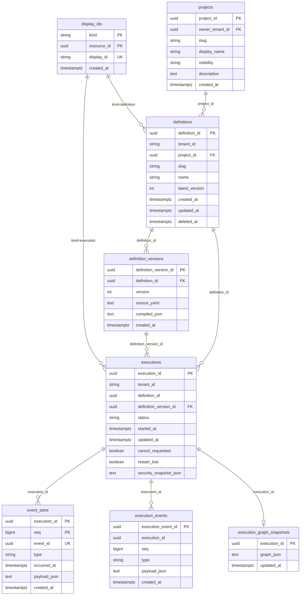
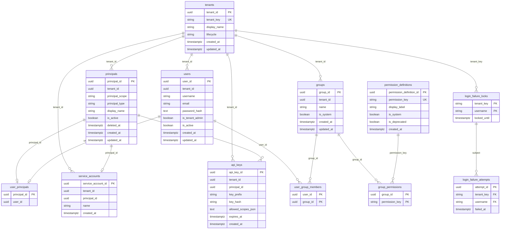
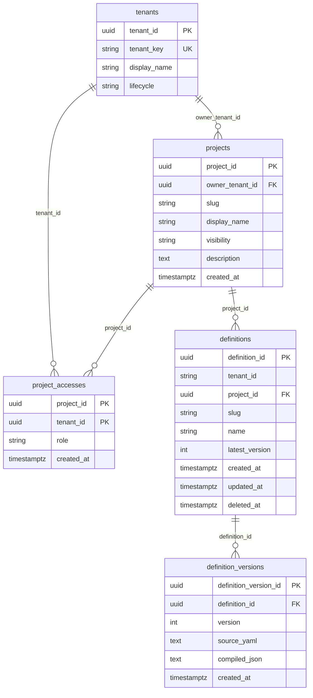
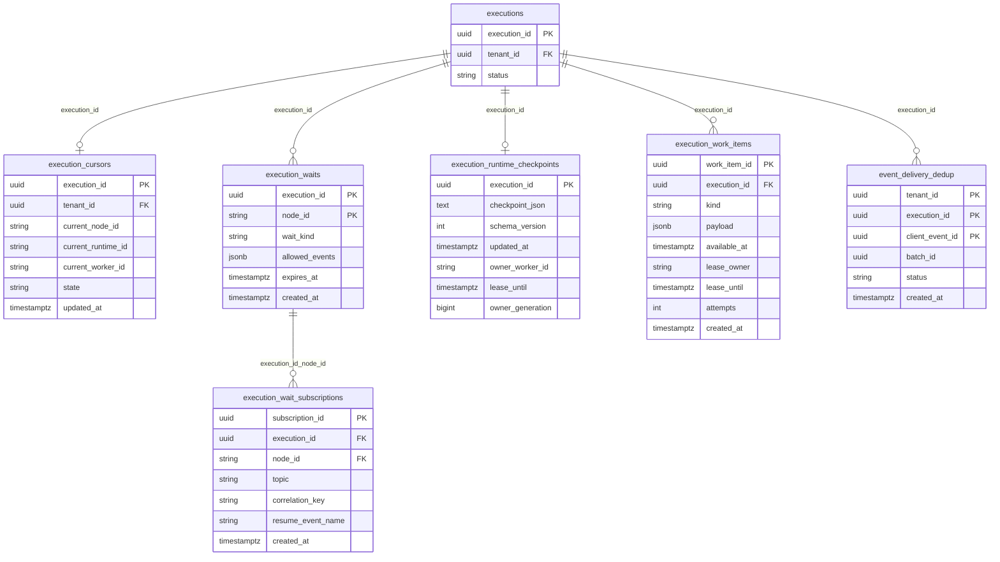
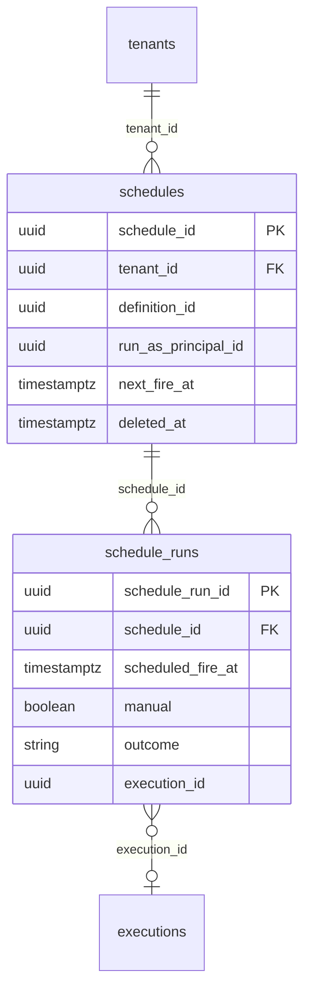

# スキーマ定義

Version: 1.23
Project: 実行型ステートマシン

**Version 1.23（2026-09-29）**: `principal_resource_grants` を追加（User / ServiceAccount の Start 用オプトイン）。

**Version 1.22（2026-09-27）**: `schedules` / `schedule_runs` を追加（定期実行。定義 YAML には埋め込まない）。

**Version 1.21（2026-09-02）**: `login_failure_locks` / `login_failure_attempts` を追加（ログイン失敗ロック。JWT 前の tenant_key 点取得。QueryFilter なし）。

**Version 1.20（2026-08-18）**: `users.username` を varchar(64)（英数字・ハイフン・アンダースコア・ドット）、`users.email` を varchar(256) に制限。

**Version 1.19（2026-08-17）**: `users.username` を追加（ログイン識別子、テナント内一意）。`email` は任意連絡先（NULL 可、非 NULL のみテナント内一意）。

**Version 1.18（2026-08-10）**: `execution_branches.fork_node_id` の役割を明確化（並列エピソードの相関キー。定義名／Join `nodeId` ではない）。

**Version 1.17（2026-08-07）**: `execution_branches` に `states_json` / `vars_json` を追加（Join 後の親 Context マージ用）。

**Version 1.16（2026-08-06）**: `execution_branches` 追加（Hosted Fork 物理子の親子リンク正本。`fork_node_id` は実行ノード ID、`join_state` / `branch_state` は定義の状態名空間）。

**Version 1.7（2026-05-27）**: `execution_cursors` / `execution_waits` 追加（operational projection / EventWait durable wait）。

**Version 1.15（2026-08-03）**: `execution_runtime_checkpoints` に所有・fencing 列（`owner_worker_id` / `lease_until` / `owner_generation`）。`execution_work_items.kind` を Start / Resume / Cancel に統一（TimerFire 廃止。Delay は Resume event）。

**Version 1.14（2026-08-01）**: `execution_wait_subscriptions` 子テーブルを追加。`execution_waits` から `correlation_key` / `topic` を削除（購読は子行の厳密一致）。

**Version 1.13（2026-07-31）**: DelayWait の Resume イベント名を `statevia.event.delay.completed` に固定（`ExecutionWaitEventNames.DelayCompleted`）。プラットフォーム予約名前空間は `statevia.event.*`。

**Version 1.12（2026-07-30）**: `execution_runtime_checkpoints` を追記（再開可能なランタイム状態の文書ストア。Application 契約は `IExecutionCheckpointStore` / `ExecutionCheckpointDocument`）。

**Version 1.11（2026-07-30）**: `execution_work_items`（lease 付き永続ワークキュー）を追加。`execution_waits` に `correlation_key` / `topic` を追加（1.14 で子テーブルへ移行）。

**Version 1.10（2026-07-29）**: `execution_waits` — `resume_token` 削除、`allowed_events jsonb` 追加（1 Wait = 1 行。Resume 削除キーは `node_id`）。

**Version 1.9（2026-07-08）**: `definitions.deleted_at`（catalog 論理削除）と `UNIQUE(project_id, slug) WHERE deleted_at IS NULL` を追記。HTTP 契約は [`specifications/api-http.md`](../specifications/api-http.md) §2.1.2〜2.1.3 を参照。

**Version 1.5（2026-05-25）**: `projects.is_public` を削除。discoverability は `visibility` のみ（公開カタログ API 未着手のため占位カラムを整理）。

**Version 1.4（2026-05-25）**: `projects` / `project_accesses` を追記。`definitions.project_id` を NOT NULL 化し `UNIQUE(project_id, slug)` に変更。project 認可 truth と discoverability（`visibility`）の分離を明記。HTTP 契約は [`specifications/api-http.md`](../specifications/api-http.md) §1.1 を参照。

**Version 1.3（2026-05-21）**: ランタイムセキュリティ境界（`tenants` / `principals` / `users` / `groups` / `api_keys` 等）を追記。Platform テーブルの PK は `<table>.<entity>_id` 命名（例: `tenants.tenant_id`, `users.user_id`）。詳細は [`security-runtime.md`](../specifications/platform/security-runtime.md) を参照。

**Version 1.2（2026-05-20）**: immutable 定義版（`definitions` / `definition_versions`）と `executions.definition_version_id` を追記。`command_dedup` / `event_delivery_dedup` を一覧に含める。truth / projection の役割分担を明記。HTTP 契約は [`specifications/api-http.md`](../specifications/api-http.md) §1.1 を参照。

**Version 1.1（2026-05-05）**: `workflow_definitions` に `tenant_id`・`updated_at` を追記（EF マイグレーション実装に準拠）。

---

Service API（C#）の EF Core マイグレーションで管理する PostgreSQL スキーマ。  
実装: `infrastructure/Statevia.Infrastructure.Persistence/` および `Migrations/`。

**書き込み経路（2026-05-20 時点）:** 定義の新規作成・publish は **`definitions` + `definition_versions` のみ**。`workflow_definitions` は移行期のレガシーテーブル（バックフィル元）として残存し、**新規 INSERT は行わない**。

**テナント識別子（2026-05-21 以降）:**

| 識別子 | 型 | 用途 |
| --- | --- | --- |
| `tenants.tenant_id` | uuid | 内部 FK・JWT クレーム `tenant_id`・セキュリティ系テーブルの `tenant_id` FK |
| `tenant_key` | varchar(64) | SDK / CLI / `X-Tenant-Id`（HTTP 契約）。実行系 FK には使わない。ログイン失敗ロックは JWT 前のためこのキーで点取得する |

実行系テーブル（`definitions` / `executions` / `execution_cursors` / `event_delivery_dedup` / レガシー `workflow_definitions`）の `tenant_id` は **`uuid` + FK → `tenants.tenant_id`**（マイグレーション `ExecutionTenantIdUuidFk`）。

---

## 1. テーブル一覧

| テーブル | 空間 | 役割 |
| --- | --- | --- |
| display_ids | 横断 | 表示用 ID（10 桁）⇔ UUID の対応（definition / execution 共通） |
| projects | KnowledgeSpace | 定義を束ねる project（オーナーテナント・discoverability ヒント） |
| project_accesses | KnowledgeSpace | **project 共有の認可 truth**（付与先テナントと role） |
| definitions | KnowledgeSpace | 論理定義メタ（slug・最新版番号の投影） |
| definition_versions | KnowledgeSpace | **immutable 定義版の truth**（YAML + compiled JSON） |
| workflow_definitions | （レガシー） | 旧 mutable 定義（移行前データ。参照専用） |
| executions | ExecutionSpace | 実行インスタンスの projection（状態・版固定・キャンセル要求） |
| event_store | ExecutionSpace | イベントソース（append-only、execution 単位で seq 付与） |
| execution_events | ExecutionSpace | 監査用イベント（event_store と同一トランザクションで記録） |
| execution_graph_snapshots | ExecutionSpace | 実行グラフのスナップショット（projection） |
| execution_cursors | ExecutionSpace | 現在位置の operational projection（read-model 正本外） |
| execution_waits | ExecutionSpace | durable wait（EventWait / CallbackWait / DelayWait）の永続化 |
| execution_wait_subscriptions | ExecutionSpace | Wait の subscribe 購読行（topic / correlation 厳密一致） |
| execution_branches | ExecutionSpace | Fork 物理子の親子リンク正本（親 Join 集約用） |
| execution_runtime_checkpoints | ExecutionSpace | 再開可能なランタイム状態の文書ストア（現行 Postgres 物理テーブル。契約は `IExecutionCheckpointStore`）。Worker 所有・fencing 列を含む |
| execution_work_items | ExecutionSpace | Start / Resume / Cancel を配送する lease 付き耐久キュー |
| schedules | ExecutionSpace | 定義の定期 Start（cron・run-as ServiceAccount・次回発火）。論理削除あり |
| schedule_runs | ExecutionSpace | 枠または手動実行の結果（started / skipped_overlap / failed） |
| command_dedup | 信頼性 | コマンド冪等（Start 等の `X-Idempotency-Key`） |
| event_delivery_dedup | 信頼性 | イベント配送冪等（Publish / Cancel の client event id） |
| tenants | Platform | テナントの truth（内部 UUID・外部 `tenant_key`・ライフサイクル） |
| permission_definitions | Platform | グローバル権限定義（キー・表示ラベル） |
| principals | Platform | 実行主体（User / ServiceAccount / System の共通行） |
| principal_resource_grants | Platform | User / ServiceAccount の Start 用オプトイン（project / definition） |
| users | Platform | 人間ユーザー（ユーザー名・任意メール・パスワードハッシュ・管理者フラグ） |
| user_principals | Platform | User ↔ Principal の 1:1 対応 |
| groups | Platform | テナント内グループ（権限付与の単位） |
| group_permissions | Platform | グループに付与された権限キー |
| user_group_members | Platform | ユーザーとグループの所属 |
| service_accounts | Platform | サービスアカウント（Principal への subtype 行） |
| api_keys | Platform | API キー（平文は保存せず prefix + hash） |
| login_failure_locks | Platform | ログイン失敗ロック（テナントキー＋ユーザー名。`locked_until` が null なら未ロック） |
| login_failure_attempts | Platform | 窓内のログイン失敗時刻（親行は `login_failure_locks`。CASCADE DELETE） |

### 1.1 truth / projection（定義・実行）

| 対象 | 役割 |
| --- | --- |
| `definition_versions` + `UNIQUE(definition_id, version)` | 定義版の **truth** |
| `definitions.latest_version` | **投影**（非権威） |
| `project_accesses` + オーナーテナント | project 認可の **truth**（`reader` / `executor` / `publisher` / `admin`） |
| `projects.visibility` | **discoverability ヒント**（認可には使わない） |
| `executions.definition_version_id` | 開始時に固定した版（execution correctness） |
| `event_store` / `execution_graph_snapshots` | 実行履歴・グラフの durable 正（既存方針） |
| `execution_cursors` | **operational projection**（分散スケジューラ向け現在位置。GET 正本ではない） |
| `execution_waits` | **durable wait** のみ（初版: EventWait） |

### 1.2 Platform テーブルと QueryFilter

| 対象 | 役割 |
| --- | --- |
| `tenants` | テナントの **truth**（`lifecycle` は `LifecycleTransitionPolicy` で遷移制御） |
| `principals` | Actor 行の **truth**（論理削除は `deleted_at` / `is_active`） |
| `principal_resource_grants` | Start のオプトイン許可。種別が空ならその種別の追加制限なし。resource への物理 FK は無い |
| 実行系 `tenant_id` uuid | **`tenants.tenant_id` FK**（HasQueryFilter は内部 UUID で fail-closed） |
| セキュリティ系 `tenant_id` uuid | **`tenants.tenant_id` 参照**（HasQueryFilter は内部 UUID で一致） |
| `IgnoreQueryFilters()` | **`IPlatformDataAccess`（Platform 専用層）のみ**許容 |
| `login_failure_locks` / `login_failure_attempts` | ログイン失敗ロック。JWT 前の `tenant_key` 点取得。**HasQueryFilter なし** |

---

## 2. テーブル定義

### 2.1 display_ids

表示用 ID（英数字 10 桁）と UUID の対応。kind で definition / execution を区別。

| カラム | 型 | 制約 | 説明 |
| --- | --- | --- | --- |
| kind | varchar(32) | PK, NOT NULL | `definition` または `execution` |
| resource_id | uuid | PK, NOT NULL | 実体の UUID（definition_id / execution_id） |
| display_id | varchar(10) | NOT NULL, UNIQUE | 表示・URL 用の短い ID |
| created_at | timestamptz | NOT NULL | 作成日時 |

### 2.2 projects

定義の所属単位。オーナーは `owner_tenant_id`（内部 UUID）。初回定義作成時は slug=`default` の project を自動作成する。

| カラム | 型 | 制約 | 説明 |
| --- | --- | --- | --- |
| project_id | uuid | PK, NOT NULL | project の一意識別子 |
| owner_tenant_id | uuid | FK → tenants, NOT NULL | オーナーテナント（内部 UUID） |
| slug | varchar(128) | NOT NULL | オーナーテナント内 slug |
| display_name | varchar(256) | NOT NULL | 表示名 |
| visibility | varchar(32) | NOT NULL | discoverability ヒント（`Private` / `Tenant` / `Public`。認可非使用） |
| description | text | NULL | 説明（任意） |
| created_at | timestamptz | NOT NULL | 作成日時 |

**インデックス:** `UNIQUE(owner_tenant_id, slug)`

### 2.3 project_accesses

project の **認可 truth**。付与先はテナント単位（Principal 単位ではない）。オーナーテナントは行なしでも **暗黙的に Admin** 相当。

| カラム | 型 | 制約 | 説明 |
| --- | --- | --- | --- |
| project_id | uuid | PK, FK → projects, NOT NULL | 対象 project |
| tenant_id | uuid | PK, FK → tenants, NOT NULL | 付与先テナント（内部 UUID） |
| role | varchar(32) | NOT NULL | `reader` / `executor` / `publisher` / `admin` |
| created_at | timestamptz | NOT NULL | 付与日時 |

**インデックス:** `PRIMARY KEY (project_id, tenant_id)`、`INDEX (tenant_id)`

**role の意味（昇順 = 権限強度）:**

| role | 許可操作（概要） |
| --- | --- |
| reader | 定義取得・一覧・グラフ参照 |
| executor | reader + 実行 Start |
| publisher | executor + 定義 publish（版追加） |
| admin | project 管理（将来 API 用） |

### 2.4 definitions

| カラム | 型 | 制約 | 説明 |
| --- | --- | --- | --- |
| definition_id | uuid | PK, NOT NULL | 定義の一意識別子 |
| tenant_id | uuid | FK → tenants, NOT NULL | オーナーテナント（内部 UUID） |
| project_id | uuid | FK → projects, NOT NULL | 所属 project |
| slug | varchar(128) | NOT NULL | project 内 slug |
| name | varchar(512) | NOT NULL | 表示名（API の `name`） |
| latest_version | int | NOT NULL | 最新版番号（**投影**。truth は `definition_versions`） |
| created_at | timestamptz | NOT NULL | 作成日時 |
| updated_at | timestamptz | NOT NULL | 最終 publish 日時 |
| deleted_at | timestamptz | NULL | catalog 論理削除日時（UTC）。NULL = Active |

**インデックス:** `UNIQUE(project_id, slug) WHERE deleted_at IS NULL`（restore 時 slug 競合の最終防衛）

**認可:** 取得・publish は `project_accesses`（+ オーナー）で評価。`definitions` は `TenantInternalId` で HasQueryFilter。

### 2.5 definition_versions

| カラム | 型 | 制約 | 説明 |
| --- | --- | --- | --- |
| definition_version_id | uuid | PK, NOT NULL | 版行の一意識別子 |
| definition_id | uuid | FK → definitions, NOT NULL | 親定義 |
| version | int | NOT NULL | 版番号（定義内で 1 始まり） |
| source_yaml | text | NOT NULL | 当該版の YAML（immutable） |
| compiled_json | text | NOT NULL | 当該版のコンパイル済み JSON（Engine 投入の正） |
| created_at | timestamptz | NOT NULL | 版作成日時 |

**インデックス:** `UNIQUE(definition_id, version)`

**publish 順序:** 同一 DB トランザクション内で **version INSERT → `definitions.latest_version` 更新**（投影逆転禁止）。

### 2.6 workflow_definitions（レガシー）

移行前の mutable 定義。`AddDefinitionVersions` マイグレーションで `definitions` / `definition_versions`（version=1）へバックフィル済み。**新規書き込み対象外。**

| カラム | 型 | 制約 | 説明 |
| --- | --- | --- | --- |
| definition_id | uuid | PK, NOT NULL | 定義の一意識別子 |
| tenant_id | uuid | FK → tenants, NOT NULL | テナント（内部 UUID） |
| name | varchar(512) | NOT NULL | 定義名 |
| source_yaml | text | NOT NULL | 元の YAML |
| compiled_json | text | NOT NULL | コンパイル済み JSON |
| created_at | timestamptz | NOT NULL | 作成日時 |
| updated_at | timestamptz | NOT NULL | 最終更新日時 |

### 2.7 executions（projection）

| カラム | 型 | 制約 | 説明 |
| --- | --- | --- | --- |
| execution_id | uuid | PK, NOT NULL | 実行インスタンスの一意識別子 |
| tenant_id | uuid | FK → tenants, NOT NULL | テナント（内部 UUID） |
| definition_id | uuid | NOT NULL | 参照元定義（論理 FK） |
| definition_version_id | uuid | FK → definition_versions, NOT NULL | **開始時に固定した版** |
| status | varchar(64) | NOT NULL | Running / Completed / Cancelled / Failed 等 |
| started_at | timestamptz | NOT NULL | 開始日時 |
| updated_at | timestamptz | NOT NULL | 最終更新日時 |
| cancel_requested | boolean | NOT NULL | キャンセル要求有無 |
| restart_lost | boolean | NOT NULL | 再起動で失効したか（U8） |
| security_snapshot_json | text | NULL | Start 時点の `ExecutionSecuritySnapshot` JSON（E4 · 認可用 BLOB。新規 Start は NOT NULL）。検索・集計は別投影テーブル想定（`jsonb` 非採用） |

### 2.8 event_store（イベントソース）

| カラム | 型 | 制約 | 説明 |
| --- | --- | --- | --- |
| execution_id | uuid | PK, NOT NULL | 実行 ID |
| seq | bigint | PK, NOT NULL | 同一 execution 内の連番（API が付与） |
| event_id | uuid | NOT NULL, UNIQUE | イベントの一意 ID |
| type | varchar(128) | NOT NULL | イベント種別 |
| occurred_at | timestamptz | NOT NULL | 発生日時 |
| actor_kind | varchar(32) | NULL | system / user / scheduler / external |
| actor_id | varchar(256) | NULL | アクター ID |
| correlation_id | varchar(256) | NULL | 相関 ID |
| causation_id | uuid | NULL | 原因イベント ID |
| schema_version | int | NOT NULL | ペイロードスキーマ版 |
| payload_json | text | NULL | ペイロード（JSON） |
| created_at | timestamptz | NOT NULL | 登録日時 |

### 2.9 execution_events（監査用）

| カラム | 型 | 制約 | 説明 |
| --- | --- | --- | --- |
| execution_event_id | uuid | PK, NOT NULL | 監査レコードの一意 ID |
| execution_id | uuid | NOT NULL | 実行 ID |
| seq | bigint | NOT NULL | event_store と同一 seq |
| type | varchar(128) | NOT NULL | イベント種別 |
| payload_json | text | NULL | ペイロード（JSON） |
| created_at | timestamptz | NOT NULL | 登録日時 |

### 2.10 execution_graph_snapshots

| カラム | 型 | 制約 | 説明 |
| --- | --- | --- | --- |
| execution_id | uuid | PK, NOT NULL | 実行 ID |
| graph_json | text | NOT NULL | ExecutionGraph の JSON |
| updated_at | timestamptz | NOT NULL | 更新日時 |

### 2.10.1 execution_cursors

| カラム | 型 | 制約 | 説明 |
| --- | --- | --- | --- |
| execution_id | uuid | PK, FK → executions, NOT NULL | 実行 ID |
| tenant_id | uuid | FK → tenants, NOT NULL | テナント（内部 UUID） |
| current_node_id | varchar(64) | NULL | 現在アクティブなグラフノード ID |
| current_runtime_id | varchar(128) | NULL | 将来 RuntimeSpace 連携用 |
| current_worker_id | varchar(128) | NULL | worker 識別子 |
| state | varchar(32) | NOT NULL | Running / Completed 等 |
| updated_at | timestamptz | NOT NULL | 更新日時 |

### 2.10.2 execution_waits

| カラム | 型 | 制約 | 説明 |
| --- | --- | --- | --- |
| execution_id | uuid | PK, FK → executions, NOT NULL | 実行 ID |
| node_id | varchar(64) | PK, NOT NULL | 待機中 Wait ノード ID（Resume 成功時の削除キー） |
| wait_kind | varchar(32) | NOT NULL | EventWait / CallbackWait / DelayWait |
| allowed_events | jsonb | NOT NULL | 許可イベント名配列（EventWait は WaitEventRouteTable 由来。DelayWait は `statevia.event.delay.completed` のみ。Subscribe は `statevia.event.subscribe.{index}`） |
| expires_at | timestamptz | NULL | 期限（EventWait は null。DelayWait は必須） |
| created_at | timestamptz | NOT NULL | 作成日時 |

**主キー:** `(execution_id, node_id)`（1 Wait ノード = 1 行）。旧 `(execution_id, resume_token)` インデックスは廃止。集合配送の購読条件は子テーブル `execution_wait_subscriptions`。

### 2.10.2a execution_wait_subscriptions

Wait の `subscribe` 購読（1 Wait ノードあたり 0 件以上）。`POST /v1/events` の照合対象。

| カラム | 型 | 制約 | 説明 |
| --- | --- | --- | --- |
| subscription_id | uuid | PK, NOT NULL | 購読行 ID |
| execution_id | uuid | FK → execution_waits, NOT NULL | 実行 ID |
| node_id | varchar(64) | FK → execution_waits, NOT NULL | Wait ノード ID |
| topic | varchar(256) | NOT NULL | 購読トピック |
| correlation_key | varchar(256) | NOT NULL | 正規化済み key（未指定は空文字） |
| resume_event_name | varchar(256) | NOT NULL | Resume に渡す内部イベント名 |
| created_at | timestamptz | NOT NULL | 作成日時 |

**外部キー:** `(execution_id, node_id)` → `execution_waits` ON DELETE CASCADE。**インデックス:** `(topic, correlation_key)`。照合は両列の厳密一致（NULL 比較なし）。

### 2.10.2c execution_branches

Hosted Runtime が Fork を物理子 execution に展開したときの親子リンク正本。Join 充足判定・合成グラフの材料。振る舞い契約（展開リトライ、予約 Resume、兄弟参照不可、GET 時合成）は [fork-join.md](../specifications/execution/fork-join.md)。

| カラム | 型 | 制約 | 説明 |
| --- | --- | --- | --- |
| parent_execution_id | uuid | PK, FK → executions, NOT NULL | 親（ネスト時は親役）execution |
| fork_node_id | varchar(64) | PK, NOT NULL | 当該並列エピソードの相関キー（親グラフ上の Fork 到達 `nodeId`。定義名／Join `nodeId` ではない） |
| branch_state | varchar(256) | PK, NOT NULL | 分岐先頭状態名 |
| execution_id | uuid | UNIQUE, FK → executions, NOT NULL | 子 execution |
| join_state | varchar(256) | NOT NULL | Join 状態名 |
| status | varchar(64) | NOT NULL | Running / Completed / Failed / Cancelled |
| output_json | jsonb | NULL | 終端 output 退避（任意） |
| states_json | jsonb | NULL | 子終端時点の `states`（Join 後の親 Context マージ用。任意） |
| vars_json | jsonb | NULL | 子終端時点の `vars`（Join 後の親 Context マージ用。任意） |
| created_at | timestamptz | NOT NULL | 作成日時 |
| updated_at | timestamptz | NOT NULL | 更新日時 |

**主キー:** `(parent_execution_id, fork_node_id, branch_state)`。**一意:** `execution_id`。両 FK は `executions` へ ON DELETE CASCADE。

### 2.10.2b execution_runtime_checkpoints

再開可能なランタイム状態の **文書ストア**（キー = `execution_id`）。Application は `IExecutionCheckpointStore` / `ExecutionCheckpointDocument` 経由でのみ扱い、物理テーブル名や RDB 行モデルに依存しない。現行実装は本テーブルへの Postgres アダプタ。実行中の Worker 所有と fencing も本文書に載せる。

| カラム | 型 | 制約 | 説明 |
| --- | --- | --- | --- |
| execution_id | uuid | PK, FK → executions, NOT NULL | 文書キー（実行 ID） |
| checkpoint_json | text / jsonb | NOT NULL | Engine `ExecutionRuntimeCheckpoint` の JSON |
| schema_version | integer | NOT NULL | 文書スキーマ版 |
| updated_at | timestamptz | NOT NULL | 更新日時 |
| owner_worker_id | varchar(128) | NULL | 実行中の Worker ID。Wait 中 / 未所有は NULL |
| lease_until | timestamptz | NULL | 所有 lease の UTC 期限（recovery 検知用） |
| owner_generation | bigint | NOT NULL | fencing token。所有獲得のたびに +1 |

**インデックス:** `lease_until`（期限切れ所有スキャン）。ステップ完了・heartbeat 更新は `owner_generation` 一致条件付き。

### 2.10.3 execution_work_items

| カラム | 型 | 制約 | 説明 |
| --- | --- | --- | --- |
| work_item_id | uuid | PK, NOT NULL | ワーク項目 ID |
| execution_id | uuid | FK → executions, NOT NULL | 対象実行 |
| kind | varchar(32) | NOT NULL | Start / Resume / Cancel |
| payload | jsonb | NOT NULL | 種別ごとの入力（Resume は mode が event または recovery） |
| available_at | timestamptz | NOT NULL | 処理可能日時 |
| lease_owner | varchar(128) | NULL | 処理権を取得した worker |
| lease_until | timestamptz | NULL | lease 期限 |
| attempts | integer | NOT NULL | claim 回数 |
| created_at | timestamptz | NOT NULL | 作成日時 |

**インデックス:** `(available_at, lease_until)`。claim は `FOR UPDATE SKIP LOCKED` で競合を避ける。

### 2.10.4 schedules

定義に埋め込まない定期 Start。発火は既存の Start work item（`kind=Start`）を積む。

| カラム | 型 | 制約 | 説明 |
| --- | --- | --- | --- |
| schedule_id | uuid | PK, NOT NULL | スケジュール ID |
| tenant_id | uuid | FK → tenants, NOT NULL | テナント |
| definition_id | uuid | NOT NULL | 対象定義 |
| definition_version_id | uuid | NULL | 固定する版。NULL は発火時点の latest |
| run_as_principal_id | uuid | NOT NULL | 実行 Owner にする ServiceAccount の Principal |
| created_by_principal_id | uuid | NOT NULL | 作成者。実行 Owner ではない |
| name | varchar(128) | NOT NULL | テナント内の表示名 |
| cron_expression | varchar(128) | NOT NULL | 5 フィールド cron |
| time_zone | varchar(64) | NOT NULL | IANA タイムゾーン |
| overlap_policy | varchar(16) | NOT NULL | `skip` または `allow` |
| input_json | text | NULL | Start に渡す input。一覧 API には出さない |
| enabled | boolean | NOT NULL | false の行は claim しない |
| deleted_at | timestamptz | NULL | 論理削除。非 NULL は発火しない |
| next_fire_at | timestamptz | NOT NULL | 次枠（UTC） |
| created_at | timestamptz | NOT NULL | 作成日時 |
| updated_at | timestamptz | NOT NULL | 更新日時 |

**インデックス:** `(enabled, deleted_at, next_fire_at)`（due claim）。`UNIQUE (tenant_id, name) WHERE deleted_at IS NULL`。`tenant_id`。

欠発（保存枠の次枠も now 以下）は行を増やさず `next_fire_at` だけ進める。

### 2.10.5 schedule_runs

| カラム | 型 | 制約 | 説明 |
| --- | --- | --- | --- |
| schedule_run_id | uuid | PK, NOT NULL | 実行記録 ID |
| schedule_id | uuid | FK → schedules, NOT NULL | 親スケジュール（削除時 CASCADE） |
| tenant_id | uuid | FK → tenants, NOT NULL | テナント |
| scheduled_fire_at | timestamptz | NULL | cron 枠。手動実行は NULL |
| manual | boolean | NOT NULL | 手動実行なら true |
| outcome | varchar(32) | NOT NULL | `started` / `skipped_overlap` / `failed` |
| execution_id | uuid | NULL | Start できた実行。失敗・skip は NULL |
| error_code | varchar(64) | NULL | 失敗時のコード |
| created_at | timestamptz | NOT NULL | 記録日時 |

**インデックス:** `UNIQUE (schedule_id, scheduled_fire_at) WHERE scheduled_fire_at IS NOT NULL`（同一 cron 枠は 1 行）。`tenant_id`。

### 2.11 command_dedup

| カラム | 型 | 制約 | 説明 |
| --- | --- | --- | --- |
| dedup_key | text | PK, NOT NULL | 冪等キー（テナント・エンドポイント・idempotency key 等の合成） |
| endpoint | text | NOT NULL | HTTP メソッド + パス |
| idempotency_key | text | NOT NULL | `X-Idempotency-Key` |
| request_hash | text | NULL | リクエスト本文のハッシュ |
| status_code | int | NULL | キャッシュした HTTP ステータス |
| response_body | text | NULL | キャッシュしたレスポンス本文 |
| created_at | timestamptz | NOT NULL | 作成日時 |
| expires_at | timestamptz | NOT NULL | 有効期限 |

### 2.12 event_delivery_dedup

| カラム | 型 | 制約 | 説明 |
| --- | --- | --- | --- |
| tenant_id | uuid | PK, FK → tenants, NOT NULL | テナント（内部 UUID） |
| execution_id | uuid | PK, NOT NULL | 実行 ID |
| client_event_id | uuid | PK, NOT NULL | クライアント発行イベント ID |
| batch_id | uuid | NULL | バッチ ID |
| status | varchar(32) | NOT NULL | RECEIVED / APPLIED 等 |
| accepted_at | timestamptz | NOT NULL | 受付日時 |
| applied_at | timestamptz | NULL | 適用日時 |
| error_code | varchar(128) | NULL | エラーコード |
| updated_at | timestamptz | NOT NULL | 更新日時 |

**インデックス:** `(tenant_id, execution_id, batch_id)`

### 2.13 tenants

テナントの truth。初回マイグレーションで `tenant_key = default` の行をシードする。

| カラム | 型 | 制約 | 説明 |
| --- | --- | --- | --- |
| tenant_id | uuid | PK, NOT NULL | 内部テナント ID（不変） |
| tenant_key | varchar(64) | NOT NULL, UNIQUE | 外部向けキー（`X-Tenant-Id` / JWT。immutable） |
| display_name | varchar(256) | NOT NULL | 表示名 |
| lifecycle | varchar(32) | NOT NULL | `Active` / `Suspended` / `Archived` |
| created_at | timestamptz | NOT NULL | 作成日時 |
| updated_at | timestamptz | NOT NULL | 更新日時 |

**インデックス:** `UNIQUE(tenant_key)`

**シード:** `tenant_id = 00000000-0000-4000-8000-000000000001`, `tenant_key = default`, `lifecycle = Active`

### 2.14 permission_definitions

グローバル権限定義。テナント横断の権限キー辞書。

| カラム | 型 | 制約 | 説明 |
| --- | --- | --- | --- |
| permission_definition_id | uuid | PK, NOT NULL | 行 ID |
| permission_key | varchar(128) | NOT NULL, UNIQUE | 権限キー（例: `workflow:start`） |
| display_label | varchar(256) | NOT NULL | 表示ラベル |
| display_key | varchar(128) | NULL | UI 表示用キー |
| owner_type | varchar(64) | NULL | 所有者種別 |
| owner_key | varchar(128) | NULL | 所有者キー |
| is_system | boolean | NOT NULL | システム予約か |
| is_deprecated | boolean | NOT NULL | 非推奨か |
| created_at | timestamptz | NOT NULL | 作成日時 |

**インデックス:** `UNIQUE(permission_key)`

### 2.15 principals

実行主体の共通行。User / ServiceAccount / System を `principal_type` で区別する。

| カラム | 型 | 制約 | 説明 |
| --- | --- | --- | --- |
| principal_id | uuid | PK, NOT NULL | Principal ID |
| tenant_id | uuid | NOT NULL | 所属テナント（論理 FK → `tenants.tenant_id`） |
| principal_scope | varchar(32) | NOT NULL | `Tenant` / `Platform` |
| principal_type | varchar(32) | NOT NULL | `User` / `ServiceAccount` / `System` |
| display_name | varchar(256) | NOT NULL | 表示名 |
| is_system | boolean | NOT NULL | システム予約か |
| is_active | boolean | NOT NULL | 有効か |
| disabled_at | timestamptz | NULL | 無効化日時 |
| deleted_at | timestamptz | NULL | 論理削除日時 |
| created_at | timestamptz | NOT NULL | 作成日時 |
| updated_at | timestamptz | NOT NULL | 更新日時 |

### 2.16 users

人間ユーザー。ログイン識別子は **`username`**（テナント内一意）。許可は英大文字・小文字・数字と、途中のみのハイフン・アンダースコア・ドット。先頭・末尾の記号は不可。`email` は任意の連絡先であり、認証には使わない。パスワードは **平文を保存せず** `password_hash` のみ保持する。

| カラム | 型 | 制約 | 説明 |
| --- | --- | --- | --- |
| user_id | uuid | PK, NOT NULL | ユーザー ID |
| tenant_id | uuid | NOT NULL | 所属テナント（論理 FK → `tenants.tenant_id`） |
| username | varchar(64) | NOT NULL | ログインユーザー名（テナント内一意。英数字で始まり終わる。途中のみ `-` `_` `.`） |
| email | varchar(256) | NULL | 任意の連絡先メール（非 NULL のみテナント内一意） |
| password_hash | text | NOT NULL | パスワードハッシュ |
| is_tenant_admin | boolean | NOT NULL | テナント管理者か |
| is_platform_admin | boolean | NOT NULL | プラットフォーム管理者か |
| is_active | boolean | NOT NULL | 有効か |
| disabled_at | timestamptz | NULL | 無効化日時 |
| created_at | timestamptz | NOT NULL | 作成日時 |
| updated_at | timestamptz | NOT NULL | 更新日時 |

**インデックス:** `UNIQUE(tenant_id, username)`、`UNIQUE(tenant_id, email) WHERE email IS NOT NULL`

### 2.17 user_principals

User と Principal の 1:1 対応。

| カラム | 型 | 制約 | 説明 |
| --- | --- | --- | --- |
| principal_id | uuid | PK, NOT NULL | Principal ID（論理 FK → `principals.principal_id`） |
| user_id | uuid | NOT NULL | ユーザー ID（論理 FK → `users.user_id`） |

### 2.18 groups

テナント内グループ。権限付与の単位。

| カラム | 型 | 制約 | 説明 |
| --- | --- | --- | --- |
| group_id | uuid | PK, NOT NULL | グループ ID |
| tenant_id | uuid | NOT NULL | 所属テナント（論理 FK → `tenants.tenant_id`） |
| name | varchar(128) | NOT NULL | グループ名（テナント内一意） |
| is_system | boolean | NOT NULL | システム予約か |
| created_at | timestamptz | NOT NULL | 作成日時 |
| updated_at | timestamptz | NOT NULL | 更新日時 |

**インデックス:** `UNIQUE(tenant_id, name)`

### 2.19 group_permissions

グループに付与された権限キー。

| カラム | 型 | 制約 | 説明 |
| --- | --- | --- | --- |
| group_id | uuid | PK, NOT NULL | グループ ID（論理 FK → `groups.group_id`） |
| permission_key | varchar(128) | PK, NOT NULL | 権限キー（論理 FK → `permission_definitions.permission_key`） |

### 2.20 user_group_members

ユーザーとグループの多対多所属。

| カラム | 型 | 制約 | 説明 |
| --- | --- | --- | --- |
| user_id | uuid | PK, NOT NULL | ユーザー ID（論理 FK → `users.user_id`） |
| group_id | uuid | PK, NOT NULL | グループ ID（論理 FK → `groups.group_id`） |

### 2.20a service_account_group_members

サービスアカウントとグループの多対多所属（API キー等の非人間主体の権限展開用）。

| カラム | 型 | 制約 | 説明 |
| --- | --- | --- | --- |
| service_account_id | uuid | PK, NOT NULL | サービスアカウント ID（論理 FK → `service_accounts.service_account_id`） |
| group_id | uuid | PK, NOT NULL | グループ ID（論理 FK → `groups.group_id`） |

### 2.21 service_accounts

サービスアカウント。Principal 行と 1:1 で対応する subtype 行。

| カラム | 型 | 制約 | 説明 |
| --- | --- | --- | --- |
| service_account_id | uuid | PK, NOT NULL | サービスアカウント ID |
| tenant_id | uuid | NOT NULL | 所属テナント（論理 FK → `tenants.tenant_id`） |
| principal_id | uuid | NOT NULL | Principal ID（論理 FK → `principals.principal_id`） |
| name | varchar(128) | NOT NULL | 表示名 |
| created_at | timestamptz | NOT NULL | 作成日時 |

### 2.22 api_keys

API キー。**平文キーは保存しない**。lookup 用に `key_prefix` と `key_hash` のみ保持する。

| カラム | 型 | 制約 | 説明 |
| --- | --- | --- | --- |
| api_key_id | uuid | PK, NOT NULL | API キー行 ID |
| tenant_id | uuid | NOT NULL | 所属テナント（論理 FK → `tenants.tenant_id`） |
| principal_id | uuid | NOT NULL | 発行主体（論理 FK → `principals.principal_id`） |
| key_prefix | varchar(16) | NOT NULL | 表示・lookup 用 prefix（先頭数文字） |
| key_hash | varchar(128) | NOT NULL | 保存用ハッシュ（SHA-256 Base64 等） |
| allowed_scopes_json | text | NOT NULL | 許可スコープ（JSON 配列。交差のみ適用） |
| expires_at | timestamptz | NULL | 有効期限 |
| last_used_at | timestamptz | NULL | 最終利用日時 |
| created_at | timestamptz | NOT NULL | 作成日時 |

**インデックス:** `(tenant_id, key_prefix)`

### 2.23 login_failure_locks

公開ログインの失敗ロック。キーは JWT 前のテナントキー＋ユーザー名。未知主体の行は作らない。`users` への FK は置かない。`tenants.tenant_key` への FK は置かない（ログインキーとの一致を優先）。

| カラム | 型 | 制約 | 説明 |
| --- | --- | --- | --- |
| tenant_key | varchar(64) | PK, NOT NULL | ログイン要求のテナントキー |
| username | varchar(64) | PK, NOT NULL | ログイン要求のユーザー名（1〜64。既存契約） |
| locked_until | timestamptz | NULL | ロック期限。null なら未ロック |

**インデックス:** `(locked_until)`

### 2.24 login_failure_attempts

窓内の失敗時刻。親は `login_failure_locks`。親削除で CASCADE DELETE。

| カラム | 型 | 制約 | 説明 |
| --- | --- | --- | --- |
| attempt_id | uuid | PK, NOT NULL | 失敗行 ID |
| tenant_key | varchar(64) | FK → login_failure_locks, NOT NULL | 親のテナントキー |
| username | varchar(64) | FK → login_failure_locks, NOT NULL | 親のユーザー名 |
| failed_at | timestamptz | NOT NULL | 失敗時刻 |

**インデックス:** `(tenant_key, username, failed_at)`

### 2.25 principal_resource_grants

User と ServiceAccount の Start を絞るオプトイン。行が無い種別は、その種別の追加制限が無い。project の行と definition の行が両方あるときは両方を満たす定義だけが通る。System には付けない。resource への物理 FK は置かない（削除済み定義の行が残っても Start は 404）。置換は種別をまたいで行を作り直す。`created_at` は置換時刻。

| カラム | 型 | 制約 | 説明 |
| --- | --- | --- | --- |
| principal_id | uuid | PK, FK → principals, NOT NULL | 対象 Principal。親削除で CASCADE |
| resource_kind | varchar(32) | PK, NOT NULL | `project` または `definition`（CHECK） |
| resource_id | uuid | PK, NOT NULL | project または論理定義の ID。物理 FK は無い |
| tenant_id | uuid | FK → tenants, NOT NULL | 所属テナント。RESTRICT。HasQueryFilter |
| created_at | timestamptz | NOT NULL | 置換時刻 |

**インデックス:** `PRIMARY KEY (principal_id, resource_kind, resource_id)`、`INDEX (tenant_id)`

**CHECK:** `resource_kind IN ('project', 'definition')`

---

## 3. ER 図

- **display_ids**: `resource_id` は `definitions.definition_id` または `executions.execution_id` に対応（kind で区別）。
- **definitions.project_id** → **projects.project_id**（定義の所属 project。認可 truth は `project_accesses` — §3.2 参照）。
- **definitions.deleted_at**: catalog 論理削除（NULL = Active）。
- **executions.definition_version_id** → **definition_versions.definition_version_id**（実行開始時の版固定）。
- **executions.definition_id** → **definitions.definition_id**（論理参照。版の正は `definition_version_id`）。
- **event_store** / **execution_events** / **execution_graph_snapshots** → **executions.execution_id**。
- **operational / durable 実行系**（cursors / waits / checkpoints / work_items）は §3.3 を参照。
- **workflow_definitions** は図から省略（レガシー。バックフィル後は `definitions` / `definition_versions` が正）。

### 3.1 Platform（テナント・Principal・認可）

- **tenants.tenant_key** は外部向け不変キー。実行系 FK は `tenants.tenant_id`。ログイン失敗ロックは JWT 前のため `tenant_key` で点取得する（`tenants` への DB FK は置かない）。
- **principals** は User / ServiceAccount / System の共通親行。**論理削除**は `deleted_at` / `is_active` で表現する。
- **principal_resource_grants** は User / ServiceAccount の Start 用オプトイン。resource への物理 FK は無い。
- **user_principals** は User 型 Principal との 1:1 対応。
- **group_permissions.permission_key** → **permission_definitions.permission_key**（グローバル権限辞書）。
- **api_keys** は平文を保存せず **key_prefix + key_hash** のみ保持する。

### 3.2 KnowledgeSpace（project・定義）

- **projects.owner_tenant_id** → **tenants.tenant_id**（オーナーテナント。行なしでも暗黙 Admin 相当）。
- **project_accesses** は **認可 truth**（`reader` / `executor` / `publisher` / `admin`）。付与先はテナント単位。複合 PK `(project_id, tenant_id)` はいずれも FK（図上のリレーション参照）。
- **projects.visibility** は discoverability ヒントのみ（認可非使用）。
- **definitions** の slug 一意性は **project 内**（`UNIQUE(project_id, slug) WHERE deleted_at IS NULL`）。`tenant_id` varchar は移行期のオーナー表現。

### 3.3 ExecutionSpace（operational / durable）

実行の operational projection・durable wait・ランタイム checkpoint（所有・fencing）・ワークキュー。§3 の投影系（`event_store` 等）とは別に描く。

- **execution_cursors**: 現在位置の operational projection（GET 正本ではない）。
- **execution_waits**: 1 Wait ノード = 1 行。複合 PK `(execution_id, node_id)`。
- **execution_wait_subscriptions**: `(execution_id, node_id)` → `execution_waits` ON DELETE CASCADE。照合は `(topic, correlation_key)` 厳密一致。
- **execution_runtime_checkpoints**: 文書キー = `execution_id`。`owner_worker_id` / `lease_until` / `owner_generation` で Worker 所有と fencing。Wait 中・未所有は所有者 NULL。
- **execution_work_items**: `kind` は Start / Resume / Cancel。Resume の `payload.mode` は `event` または `recovery`。claim 用 lease は本テーブル側（checkpoint 所有とは別）。定期実行も Start を積む（専用 kind は無い）。
- **event_delivery_dedup**: Publish / Cancel 配送冪等。複合 PK `(tenant_id, execution_id, client_event_id)`。

### 3.4 定期実行

- **schedules.run_as_principal_id** は実行の Owner。作成者列とは別。
- **schedule_runs.execution_id** は Start できたときだけ。失敗・overlap skip・手動以外の欠発では実行行が無い（欠発は run 行も無い）。

---

## 4. インデックス（主要）

| テーブル | インデックス | 種別 |
| --- | --- | --- |
| display_ids | display_id | UNIQUE |
| projects | (owner_tenant_id, slug) | UNIQUE |
| project_accesses | (project_id, tenant_id) | PRIMARY KEY |
| project_accesses | tenant_id | INDEX |
| principal_resource_grants | (principal_id, resource_kind, resource_id) | PRIMARY KEY |
| principal_resource_grants | tenant_id | INDEX |
| definitions | (project_id, slug) WHERE deleted_at IS NULL | UNIQUE |
| definition_versions | (definition_id, version) | UNIQUE |
| event_store | event_id | UNIQUE |
| executions | definition_version_id | INDEX（FK） |
| execution_wait_subscriptions | (topic, correlation_key) | INDEX |
| execution_runtime_checkpoints | lease_until | INDEX |
| execution_work_items | (available_at, lease_until) | INDEX |
| schedules | (tenant_id, name) WHERE deleted_at IS NULL | UNIQUE |
| schedules | (enabled, deleted_at, next_fire_at) | INDEX |
| schedule_runs | (schedule_id, scheduled_fire_at) WHERE scheduled_fire_at IS NOT NULL | UNIQUE |
| event_delivery_dedup | (tenant_id, execution_id, batch_id) | INDEX |
| tenants | tenant_key | UNIQUE |
| permission_definitions | permission_key | UNIQUE |
| users | (tenant_id, username) | UNIQUE |
| users | (tenant_id, email) WHERE email IS NOT NULL | UNIQUE |
| groups | (tenant_id, name) | UNIQUE |
| api_keys | (tenant_id, key_prefix) | INDEX |

---

## 5. マイグレーション

| マイグレーション | 内容 |
| --- | --- |
| `20260516043215_InitialCreate` | 初期スキーマ（`workflow_definitions`、event_store、dedup 等） |
| `20260520135348_AddDefinitionVersions` | `definitions` / `definition_versions` 追加、`executions.definition_version_id` 追加とバックフィル（当時は `workflows` 列名） |
| `20260521150030_AddRuntimeSecurityBoundary` | Platform テーブル（`tenants` / `principals` / `users` / `groups` / `api_keys` 等）追加、`default` テナントシード |
| `20260524215737_AddProjectsAndProjectAccesses` | `projects` / `project_accesses` 追加、テナントごと `slug=default` project バックフィル、`definitions.project_id` NOT NULL 化、`UNIQUE(project_id, slug)` へ変更 |
| `20260524232340_RemoveProjectIsPublic` | `projects.is_public` 削除（discoverability は `visibility` のみ） |
| `20260526114350_RenameWorkflowsToExecutions` | `workflows` → `executions`、関連 FK 列 `workflow_id` → `execution_id`、`display_ids.kind` を `execution` に更新 |
| `20260526145448_RenameWorkflowEventsToExecutionEvents` | `workflow_events` → `execution_events`、PK 列 `workflow_event_id` → `execution_event_id` |
| `20260607143608_ExecutionTenantIdUuidFk` | 実行系 `tenant_id` を uuid FK（`tenants.tenant_id`）へ統一 |
| `20260608093652_AddExecutionSecuritySnapshot` | `executions.security_snapshot_json` 追加（E4） |
| `20260729152815_AddExecutionRuntimeCheckpoints` | `execution_runtime_checkpoints`（ランタイムチェックポイント文書）を追加 |
| `20260729153444_AddExecutionWorkItemsAndWaitRouting` | `execution_work_items` と `execution_waits` の topic / correlation routing 列を追加 |
| `20260801112928_AddExecutionWaitSubscriptions` | `execution_wait_subscriptions` 追加、`execution_waits` の routing 列削除 |
| `20260802173232_AddExecutionCheckpointOwnership` | `execution_runtime_checkpoints` に `owner_worker_id` / `lease_until` / `owner_generation` と `lease_until` インデックスを追加 |
| `20260817140816_AddUserUsername` | `users.username` 追加（varchar(64)）と既存 `email` からのバックフィル。`email` を NULL 可の varchar(256) にし、非 NULL のみテナント内一意 |
| `20260918172216_AddExecutionSchedules` | `schedules` / `schedule_runs` を追加 |
| `20260927160709_AddPrincipalResourceGrants` | `principal_resource_grants` を追加 |

適用: `cd service/api && dotnet ef database update --project Statevia.Service.Api`

**既存 DB への注意:** テーブルが手動作成済みで `InitialCreate` が失敗する場合は、マイグレーション履歴（`__EFMigrationsHistory`）と実スキーマの整合を確認してから適用する。未適用分のみ実行するか、クリーン DB で検証する。

スキーマの追加・変更は EF Core マイグレーションで行う。契約・運用叙述は [`specifications/api-http.md`](../specifications/api-http.md) および [`specifications/data-integration.md`](../specifications/data-integration.md) を参照。
